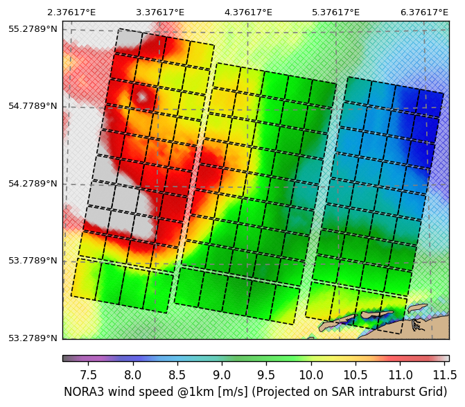
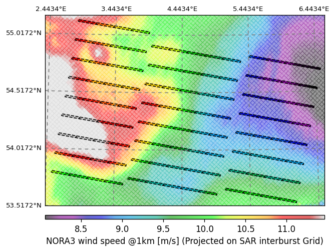

# ESAWAAI Project

**Romain Husson**, **Amine Benchaabane¹**  
**Bertrand Chapron**, **Alexis Mouche**, **Frédéric Nouguier**, **Antoine Grouazel**, **Nicolas Rascle²**  
**Mihai Datcu**, **Andrei Anghel**, **Catalin Ristea³**  
**Charlotte Bay Hasager**, **Krystallia Dimitriadou⁴**  
**Nicolas Longépé⁵**

¹ Collect Localisation Satellites (**CLS**, France)  
² **IFREMER** (France)  
³ University Politehnica of Bucharest (**UPB**)  
⁴ Technical University of Denmark (**DTU**)  
⁵ European Space Agency (**ESA**)

**The Explainable SAR measurements for Wind Assessment with Artificial 
Intelligence (ESAWAAI)** project, funded by the **European Space Agency (ESA)**, is dedicated to advancing the retrieval of sea surface wind fields using a diverse range of observables derived from multi-polarization **Single-Look Complex (SLC)** Synthetic Aperture Radar (**SAR**) data, with a particular focus on **Sentinel-1** sensors. By combining advanced SAR processing techniques with **Artificial Intelligence (AI)** and **explainable AI (XAI)**, the project is building a comprehensive legacy dataset to support both **data-driven** and **physics-informed** **Deep Learning (DL)** models for wind estimation. A central objective is to enhance the interpretability of the **Geophysical Model Function (GMF)** used in SAR-based wind retrieval, improve transparency in how radar observables relate to geophysical wind parameters, propose wind retrieval schemes avoiding the use of *a priori* ancillary wind information and improving performances with respect to state-of-the-art wind estimation algorithms.

This first dataset release focuses on the [NORA3](https://thredds.met.no/thredds/projects/nora3_subsets.html) domain, centered over the **North Sea**, and aggregates **SLC SAR data** from the [SAR WAVE project](https://www.sarwave.org/), along with operational **OCN SAR** variables and **Numerical Weather Prediction** outputs from the **NORA3** model. **SLC** data acquisitions are processed using the **SAR WAVE** framework.
The first version of the legacy dataset for the ESAWAAI project is now available in [EODTL](https://www.eotdl.com/datasets/ESAWAAI)  : 
Only **Sentinel-1 Interferometric Wide (IW)** mode data in **VV polarization** are considered in this release. The dataset preserves the structure of the original **Level-1 SLC** product: each subswath (**IW1**, **IW2**, **IW3**) is processed independently. Within each subswath, data is already segmented by burst, and each burst is further divided into smaller tiles to support not only wind retrieval but also wave-related analyses.

Two spatial grids are defined to organize the data:
- **An intraburst grid**, where tiles are extracted within individual bursts
- **An interburst grid**, where tiles represent the overlap areas between successive bursts

This structured tiling approach ensures flexibility and consistency for downstream processing tasks, such as machine learning model training and evaluation.

Developed by a consortium of leading institutions—**CLS (France)**, **IFREMER (France)**, **DTU (Technical University of Denmark)**, and **UPB (University Politechnica of Bucharest, Romania)**—the **ESAWAAI** project also aims to deepen scientific understanding of **SAR observables** across varying metocean and geometric conditions. Ultimately, this work supports a range of applications in **meteorology**, **climate science**, and **wind energy resource assessment**.

**Example 1 :**
Projection of the Model Nora wind speed (at 3 km) onto the SAR intra-burst grid at 1 km resolution.
Colocated SAR product reference: S1B_IW_SLC__1SDV_20190701T055700_20190701T055728_016936_01FDEC_7B5E.SAFE.”

**Example 2 :**
Projection of the Model Nora wind speed (at 3 km) onto the SAR inter-burst grid at 1 km resolution.

A detailed documentation of the dataset is provided in the accompanying [[ESAWAAI] - Ready Legacy Dataset Report - CLS-ENV-NT-24-0452 - V1.0.pdf](ressources%2F%5BESAWAAI%5D%20-%20Ready%20Legacy%20Dataset%20Report%20-%20CLS-ENV-NT-24-0452%20-%20V1.0.pdf) file, which includes illustrations, data descriptions, and usage guidelines. This document will be updated and expanded with future releases of the dataset to reflect any changes or additions.

